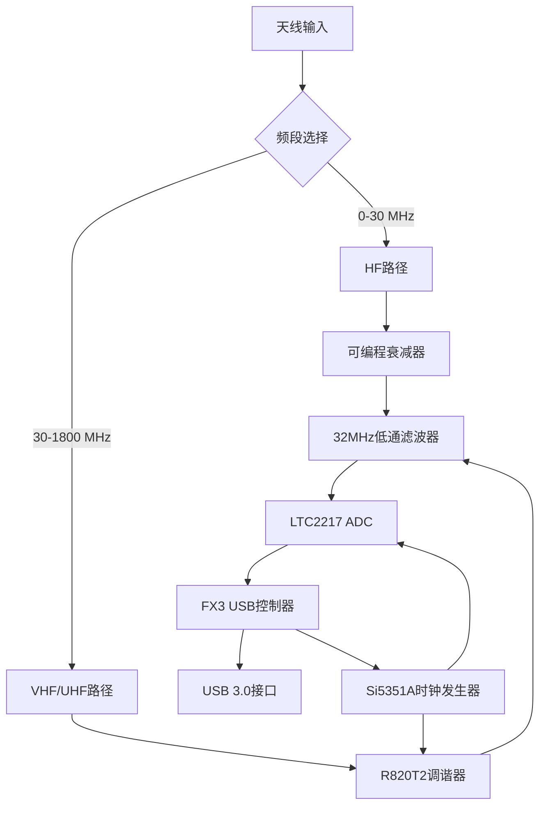
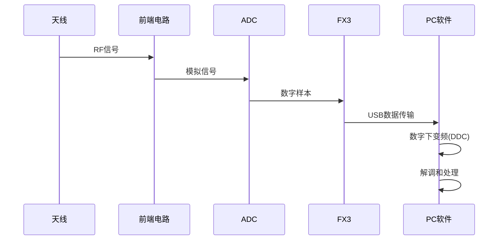
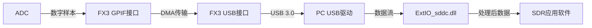

# BBRF103 软件定义无线电接收器

## 项目概述

BBRF103是一个高性能的软件定义无线电(SDR)接收器，由Oscar Steila (IK1XPV)设计开发。该接收器支持宽频段接收，覆盖0-30MHz的HF频段和30-1800MHz的VHF/UHF频段，可用于各种无线电应用，如业余无线电、短波收听、频谱监测等。

BBRF103采用直接采样技术处理HF信号，并使用R820T2调谐器处理VHF/UHF信号。系统通过USB 3.0接口与计算机连接，提供高速数据传输，支持宽带接收。

## 硬件组成

BBRF103硬件主要由以下组件构成：

1. **Cypress FX3 USB控制器(CYUSB3014)** - 负责USB 3.0通信和系统控制
2. **LTC2217 ADC** - 高速模数转换器，用于信号采样
3. **R820T2调谐器** - 用于VHF/UHF频段的信号接收和下变频
4. **Si5351A时钟发生器** - 提供系统所需的各种时钟信号
5. **74CBTLV3253多路复用器** - 用于选择HF或VHF/UHF信号路径
6. **32MHz低通滤波器** - 限制信号带宽
7. **可编程衰减器** - 用于调整信号电平

## 工作原理

### 系统框图

### 工作模式

BBRF103支持两种主要工作模式：

1. **HF模式(0-30MHz)**：
   - 信号直接通过可编程衰减器和低通滤波器
   - ADC直接采样HF信号
   - 采样率可达64MSPS
   - 数字下变频(DDC)在软件中实现

2. **VHF/UHF模式(30-1800MHz)**：
   - 信号通过R820T2调谐器进行下变频
   - 调谐器输出中频信号
   - ADC采样中频信号
   - 数字处理在软件中完成

### 信号处理流程

## 软件架构

BBRF103的软件部分由三个主要组件组成：

1. **FX3固件** - 运行在Cypress FX3 USB控制器上的固件，负责：
   - USB通信
   - 控制ADC采样
   - 管理GPIO和I2C设备
   - 数据缓冲和传输

2. **ExtIO_sddc.dll** - 用于与SDR软件(如HDSDR)接口的DLL库，负责：
   - 硬件初始化和配置
   - 频率调谐
   - 增益控制
   - 数据处理和格式转换

3. **SDR应用软件** - 如HDSDR，负责：
   - 用户界面
   - 信号处理和解调
   - 音频输出
   - 频谱显示

### 数据流程

## 数字下变频(DDC)实现

BBRF103使用软件实现数字下变频(DDC)，主要步骤包括：

1. **窗口化** - 对输入样本应用窗口函数，减少频谱泄漏
2. **FFT变换** - 将时域信号转换到频域
3. **频率移位** - 通过选择FFT输出的特定区域实现调谐
4. **滤波** - 应用低通滤波器限制带宽
5. **IFFT变换** - 将处理后的频域信号转换回时域
6. **抽取** - 降低采样率，减少数据量

这一过程在ExtIO_sddc.dll的rfddc类中实现，使用FFTW库进行高效的FFT计算。

## 硬件控制

### I2C设备控制

BBRF103通过I2C总线控制多个设备：

1. **Si5351A时钟发生器**：
   - 生成ADC采样时钟
   - 生成R820T2参考时钟
   - 支持不同采样率配置

2. **R820T2调谐器**：
   - 频率设置
   - 增益控制
   - 滤波器带宽设置

### GPIO控制

FX3控制器使用GPIO管理多个硬件功能：

- LED指示灯控制
- 信号路径选择(HF/VHF)
- 衰减器控制
- 其他控制信号

## 性能参数

- **频率范围**：0-30MHz(HF)和30-1800MHz(VHF/UHF)
- **采样率**：最高64MSPS
- **ADC分辨率**：16位
- **带宽**：最大约30MHz
- **接口**：USB 3.0，支持高速数据传输
- **动态范围**：约96dB(理论值)

## 使用方法

BBRF103可与多种SDR软件配合使用，如HDSDR、SDR#等。使用步骤：

1. 安装USB驱动
2. 将ExtIO_sddc.dll放入SDR软件目录
3. 连接BBRF103设备
4. 启动SDR软件
5. 选择ExtIO_sddc作为输入设备
6. 配置频率、增益等参数
7. 开始接收

## 开发和编译

### FX3固件编译

FX3固件使用Cypress FX3 SDK开发，编译步骤：

1. 安装Cypress FX3 SDK
2. 打开Eclipse IDE
3. 导入BBRF103_SRC项目
4. 编译项目生成固件

### ExtIO_sddc.dll编译

ExtIO_sddc.dll使用Visual Studio开发，编译步骤：

1. 打开ExtIO_sddc.sln解决方案
2. 选择适当的编译配置(Debug/Release)
3. 编译项目生成DLL文件

## 总结

BBRF103是一个功能强大的软件定义无线电接收器，结合了直接采样和超外差接收技术，覆盖广泛的频率范围。其开放的软件架构和高性能硬件设计使其成为业余无线电爱好者和专业用户的理想选择。
