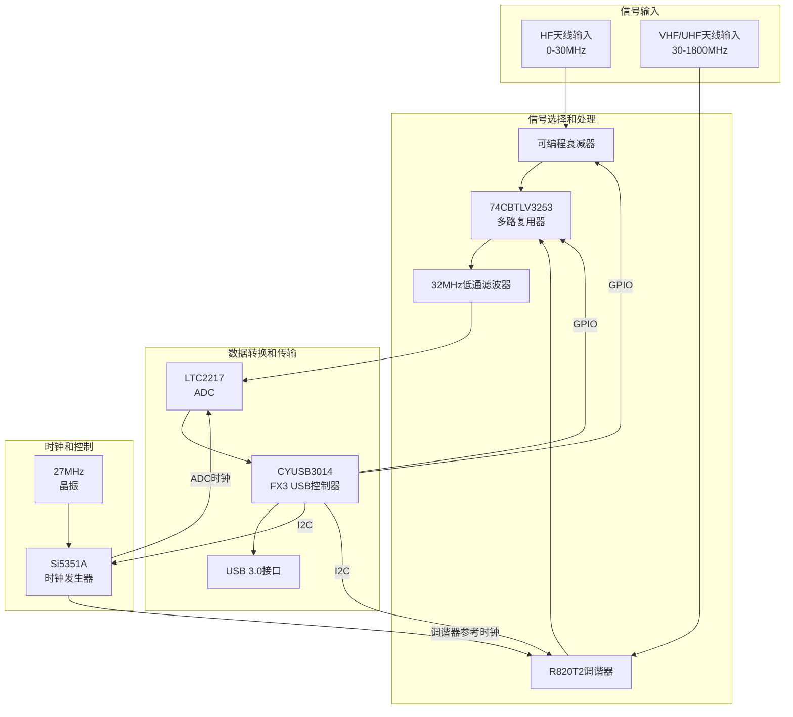
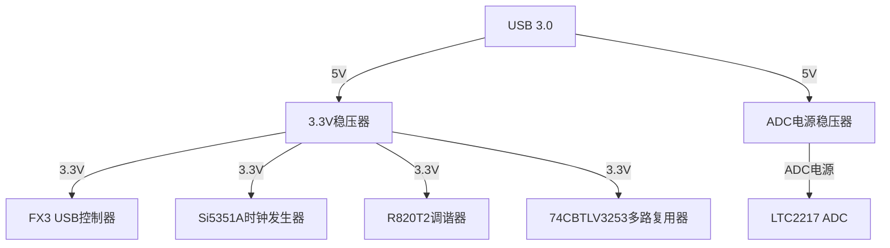

# BBRF103 硬件电路连接图

## 主要组件连接

BBRF103硬件由多个关键组件组成，下面的图表展示了这些组件之间的主要连接关系。

## 引脚连接详情

### FX3 USB控制器(CYUSB3014)主要引脚连接

| 引脚号 | 引脚名称 | 连接目标 | 功能描述 |
|-------|---------|---------|---------|
| 21 | GPIO21 | LED | 过载指示LED |
| 22 | GPIO22 | LED | 模式A指示LED |
| 23 | GPIO23 | LED | 模式B指示LED |
| 24 | GPIO24 | PWM输出 | PWM控制信号 |
| 26 | GPIO26 | 多路复用器 | 信号选择SEL0 |
| 27 | GPIO27 | 多路复用器 | 信号选择SEL1 |
| 28 | GPIO28 | 关断控制 | 关断控制信号 |
| 29 | GPIO29 | 抖动控制 | 抖动控制信号 |
| - | I2C SCL | Si5351A/R820T2 | I2C时钟线 |
| - | I2C SDA | Si5351A/R820T2 | I2C数据线 |
| - | GPIF接口 | ADC | 数据采集接口 |
| - | USB接口 | USB连接器 | USB 3.0数据传输 |

### Si5351A时钟发生器连接

| 引脚 | 连接目标 | 功能描述 |
|-----|---------|---------|
| SCL | FX3 I2C SCL | I2C时钟线 |
| SDA | FX3 I2C SDA | I2C数据线 |
| CLK0 | ADC时钟输入 | ADC采样时钟 |
| CLK1 | R820T2 | 调谐器参考时钟 |
| XA/XB | 27MHz晶振 | 参考时钟输入 |
| VDD | 电源 | 3.3V供电 |
| GND | 地 | 接地 |

### R820T2调谐器连接

| 引脚 | 连接目标 | 功能描述 |
|-----|---------|---------|
| RF_IN | VHF/UHF天线 | RF信号输入 |
| IF_OUT | 多路复用器 | 中频信号输出 |
| SCL | FX3 I2C SCL | I2C时钟线 |
| SDA | FX3 I2C SDA | I2C数据线 |
| REF_CLK | Si5351A CLK1 | 参考时钟输入 |
| VCC | 电源 | 3.3V供电 |
| GND | 地 | 接地 |

### LTC2217 ADC连接

| 引脚 | 连接目标 | 功能描述 |
|-----|---------|---------|
| AIN+ | 低通滤波器 | 模拟信号正输入 |
| AIN- | 低通滤波器 | 模拟信号负输入 |
| CLK | Si5351A CLK0 | 采样时钟输入 |
| D[15:0] | FX3 GPIF | 数据输出 |
| VDD | 电源 | 电源输入 |
| GND | 地 | 接地 |

### 74CBTLV3253多路复用器连接

| 引脚 | 连接目标 | 功能描述 |
|-----|---------|---------|
| 1S | HF信号路径 | HF信号输入 |
| 2S | R820T2 IF_OUT | VHF/UHF信号输入 |
| 1Y | 低通滤波器 | 信号输出 |
| S0 | FX3 GPIO26 | 选择控制0 |
| S1 | FX3 GPIO27 | 选择控制1 |
| VCC | 电源 | 3.3V供电 |
| GND | 地 | 接地 |

## 信号路径说明

### HF信号路径(0-30MHz)
1. 信号从HF天线输入进入
2. 通过可编程衰减器调整电平
3. 经过多路复用器选择
4. 通过32MHz低通滤波器
5. 进入ADC直接采样
6. 数据通过FX3 GPIF接口传输
7. FX3通过USB 3.0发送数据到计算机

### VHF/UHF信号路径(30-1800MHz)
1. 信号从VHF/UHF天线输入进入
2. 进入R820T2调谐器进行下变频
3. 中频信号经过多路复用器选择
4. 通过32MHz低通滤波器
5. 进入ADC采样
6. 数据通过FX3 GPIF接口传输
7. FX3通过USB 3.0发送数据到计算机

## 电源分配

BBRF103使用USB供电，通过内部稳压器提供各组件所需的电源：

## PCB布局注意事项

1. 模拟和数字部分分离，减少干扰
2. 时钟信号走线短而直，避免辐射
3. 关键信号路径阻抗匹配
4. 充分接地和去耦
5. RF部分特别注意阻抗匹配和屏蔽
6. 高速数字信号(如GPIF接口)需要控制阻抗和长度匹配
