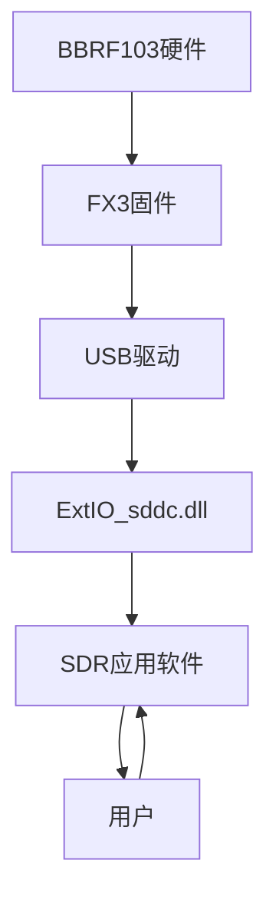

# BBRF103 项目文档索引

本文档集合详细说明了BBRF103软件定义无线电接收器的工作原理、硬件结构和软件实现。以下是文档的组织结构：

## 文档目录

1. [README.md](./README.md) - 项目概述和主要功能
   - 项目简介
   - 硬件组成
   - 工作原理
   - 软件架构
   - 数字下变频实现
   - 性能参数
   - 使用方法
   - 开发和编译指南

2. [硬件电路连接图.md](./硬件电路连接图.md) - 硬件连接详情
   - 主要组件连接图
   - 引脚连接详情
   - 信号路径说明
   - 电源分配
   - PCB布局注意事项

3. [软件流程图.md](./软件流程图.md) - 软件工作流程
   - 系统软件架构
   - FX3固件工作流程
   - ExtIO_sddc.dll工作流程
   - 数字下变频处理流程
   - 多线程处理架构
   - 硬件控制流程
   - 数据流和回调机制
   - 错误处理机制
   - 软件启动和关闭序列

## 项目概览

BBRF103是一个高性能的软件定义无线电(SDR)接收器，由Oscar Steila (IK1XPV)设计开发。该接收器支持宽频段接收，覆盖0-30MHz的HF频段和30-1800MHz的VHF/UHF频段。

系统采用直接采样技术处理HF信号，并使用R820T2调谐器处理VHF/UHF信号。通过USB 3.0接口与计算机连接，提供高速数据传输，支持宽带接收。

## 主要特点

1. **宽频段覆盖**：0-30MHz(HF)和30-1800MHz(VHF/UHF)
2. **高速数据传输**：USB 3.0接口
3. **高分辨率**：16位ADC
4. **软件可配置**：可调整采样率、增益等参数
5. **开放架构**：支持多种SDR软件

## 文档使用指南

- 初次了解项目请先阅读[README.md](./README.md)
- 硬件开发者请重点参考[硬件电路连接图.md](./硬件电路连接图.md)
- 软件开发者请重点参考[软件流程图.md](./软件流程图.md)

## 项目源代码结构

项目源代码分为三个主要部分：

1. **FX3Firmware** - FX3控制器固件
   - BBRF103_SRC - 主要源代码
   - BBRF103_GPIFII_SM - GPIF状态机配置

2. **ExtIO_sddc** - ExtIO接口DLL
   - ExtIO_sddc.cpp/h - 主要接口实现
   - i2c_r820t2.cpp/h - R820T2调谐器控制
   - i2c_si5351.cpp/h - Si5351A时钟控制
   - rfddc.cpp/h - 数字下变频实现

3. **HARDWARE** - 硬件设计文件
   - BBRF103_scheme.pdf - 电路原理图
   - BBRF103TopPCBview.pdf - PCB顶层视图
   - BBRF103bottomPCBview.pdf - PCB底层视图
   - BLOCKscheme01.pdf - 系统框图

## 贡献和开发

BBRF103是一个开源项目，欢迎贡献和改进。开发者可以通过以下方式参与：

1. 改进固件性能
2. 优化数字信号处理算法
3. 增加新功能
4. 修复已知问题
5. 改进文档

## 联系方式

项目原作者：Oscar Steila (IK1XPV)
项目网站：http://www.steila.com/blog/
