# BBRF103 软件流程图

本文档详细说明BBRF103软件定义无线电接收器的软件工作流程，包括固件、驱动和应用软件层面的数据处理过程。

## 系统软件架构

BBRF103的软件系统由三个主要部分组成：FX3固件、ExtIO_sddc.dll接口库和SDR应用软件。

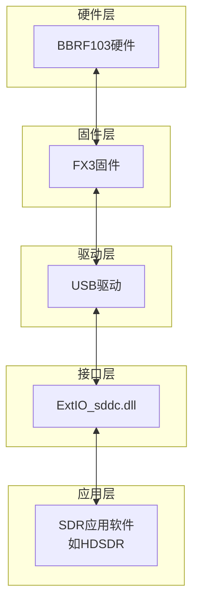

## FX3固件工作流程

FX3固件负责控制硬件、采集数据并通过USB传输到计算机。

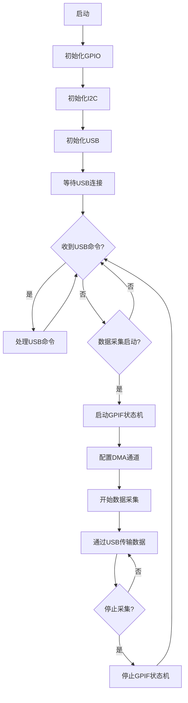

### FX3固件主要功能模块

1. **初始化模块**
   - GPIO配置
   - I2C总线初始化
   - USB描述符设置
   - GPIF接口配置

2. **USB命令处理模块**
   ```mermaid
   flowchart TD
       A[接收USB命令] --> B{命令类型}
       B -->|I2C写入| C[执行I2C写入]
       B -->|I2C读取| D[执行I2C读取]
       B -->|GPIO控制| E[设置GPIO状态]
       B -->|PWM控制| F[配置PWM输出]
       B -->|固件ID查询| G[返回固件ID]
       C & D & E & F & G --> H[返回结果]
   ```

3. **数据采集模块**
   ```mermaid
   flowchart TD
       A[GPIF状态机启动] --> B[ADC数据采集]
       B --> C[DMA传输到内存]
       C --> D[USB批量传输]
       D --> E{继续采集?}
       E -->|是| B
       E -->|否| F[停止采集]
   ```

## ExtIO_sddc.dll工作流程

ExtIO_sddc.dll是连接硬件和SDR应用软件的桥梁，负责硬件控制和信号处理。

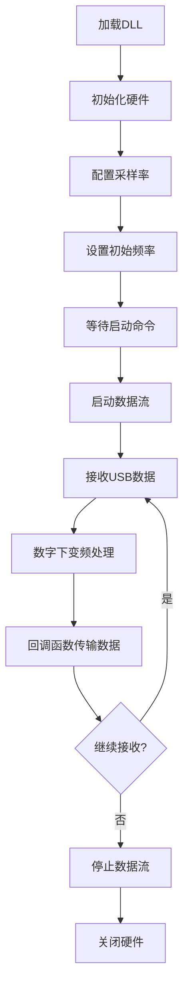

### 数字下变频(DDC)处理流程

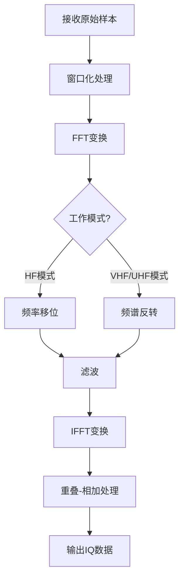

### 频率调谐实现

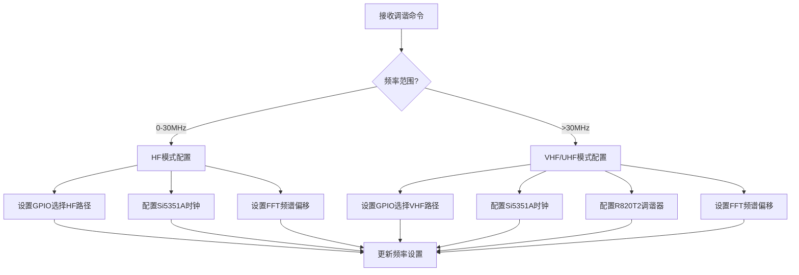

## 多线程处理架构

ExtIO_sddc.dll使用多线程架构进行数据处理，提高效率。

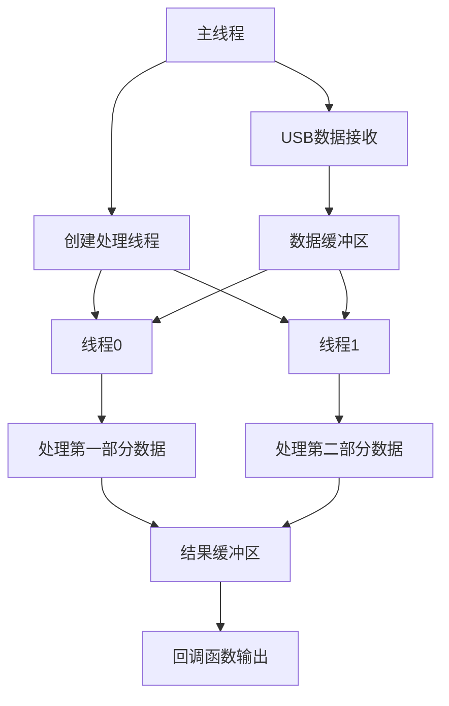

## 硬件控制流程

### I2C设备控制

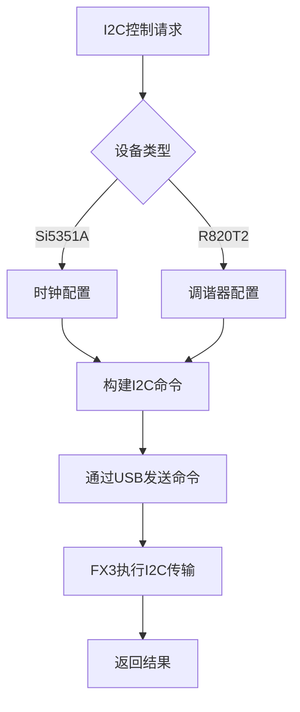

### 增益控制

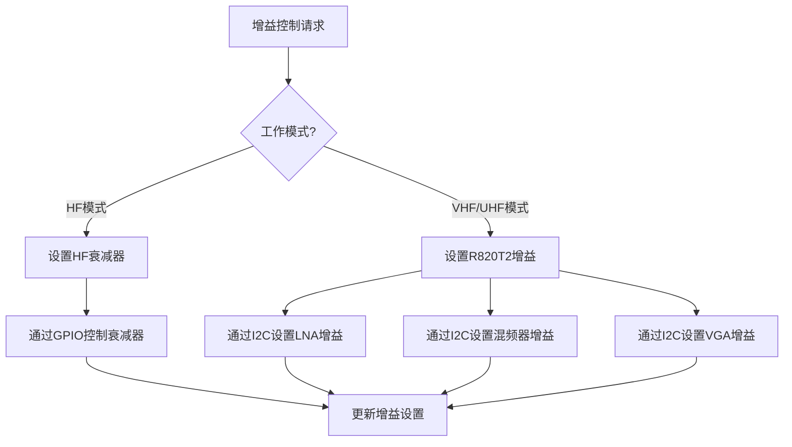

## 数据流和回调机制

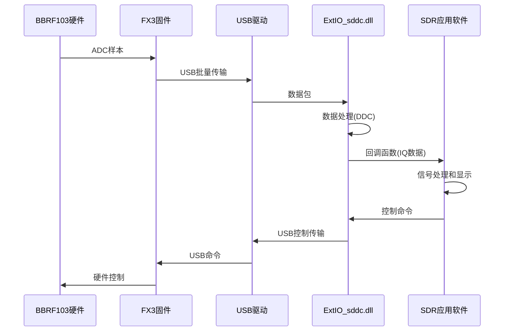

## 错误处理机制

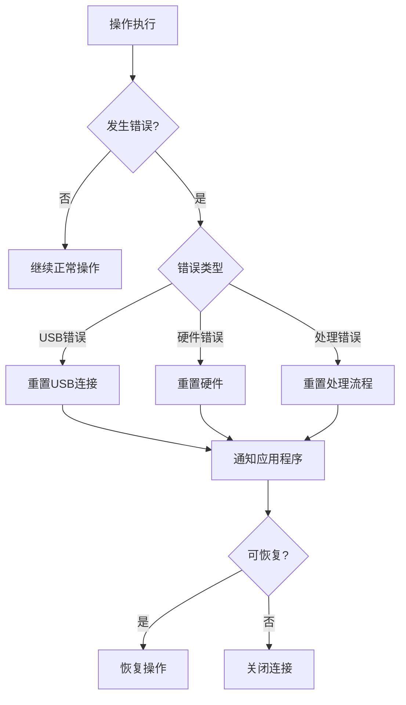

## 软件启动和初始化序列

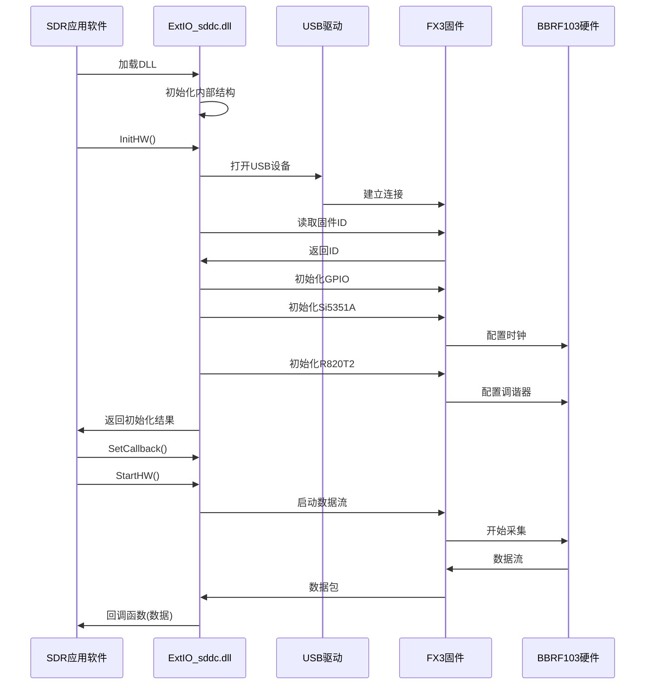

## 软件关闭序列

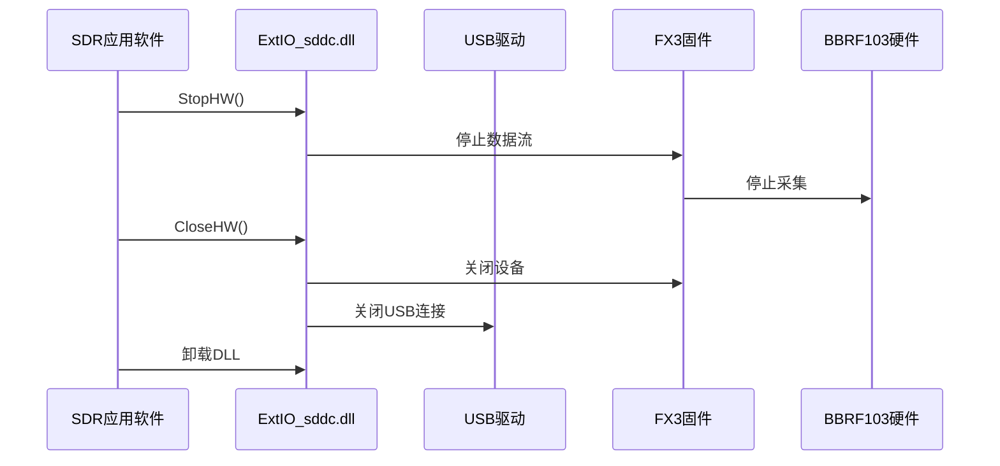

## 总结

BBRF103的软件系统采用分层架构，通过FX3固件、ExtIO_sddc.dll接口库和SDR应用软件的协同工作，实现了高效的信号采集、处理和显示。数字下变频(DDC)技术在软件中实现，使系统能够灵活处理不同频段的信号，并提供高质量的IQ数据输出。多线程处理架构提高了系统效率，使其能够处理高速数据流。
